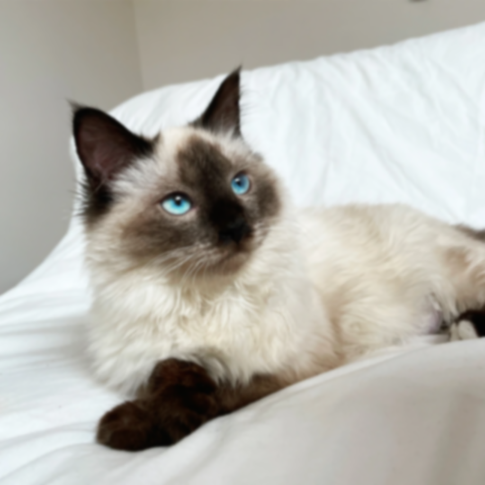
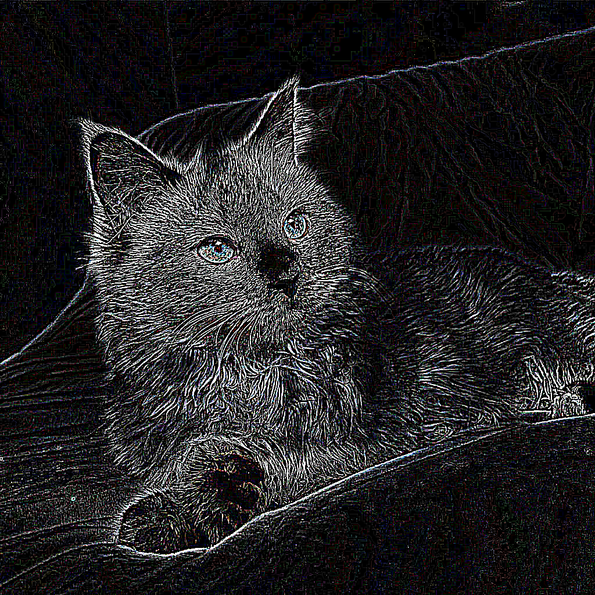
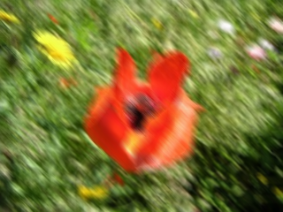
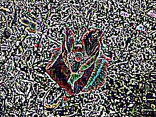

# Konvolve 
Kotlin library for image convolution with parallel processing

# Usage

## Adding library

### JitPack

Add this to the `build.gradle.kts`
```kotlin
repositories {
    mavenCentral()
    maven("https://jitpack.io")
}

dependencies {
    implementation("com.github.kinokotakenoko9:Konvolve:1.0.0")
}
```
### Locally 
If you want to install library locally, add the `.jar` dependency:
1. Copy `.jar` file into `/libs`(or other location depending on your project structure)
2. Add this to the `build.gradle.kts` 
```kotlin
dependencies {
    implementation(files("libs/konvolve-1.0.0.jar"))
}
```

## Examples
```kotlin
fun main() {
    Image("assets/images/input", "flower")
        .setParallelMode(GridParallelMode(4, 32))
        .applyKernel(GaussianKernel(5))
        .writeToFile("gs5-grid32", "assets/images/output")
}

```
See `src/main/kotlin/demo` for more example usage

# Build
Clone this repository
```
git clone git@github.com:kinokotakenoko9/Konvolve.git
```
```
cd Konvolve
```
Build the library with
```
./gradlew build
``` 
the compiled `.jar` will be located at: `build/libs/konvolve-1.0.0.jar`
> [!NOTE]
> For a successful build java 23 (or higher) is required
# Benchmarks

## Running
```
./gradlew benchmark
```
```
./gradlew benchmarkPlot
```

## Configuration
Benchmark configuration can be found in `build.gradle.kts` and `src/main/kotlin/benchmark/Benchmark.kt`

## Experiments  

Test environment:
* **OS:** Ubuntu 24.04.3 LTS x86_64
* **CPU:** AMD Ryzen 7 7700 (16) @ 5.392GHz
* **RAM:** 31167MiB

### Single Image

Benchmarks of different parallel strategies were collected using `kotlinx-benchmark` with 1 warmup on two test images: `flower.bmp` (320x240 px) and `cat.bmp` (1024x1024 px). 

<p align="center">
  
  
</p>

Results are shown on the heatmaps below.


### Asynchronous Convolution

Asynchronous convolution of images was tested on the [sp4g8h7v8k-1 dataset](https://data.mendeley.com/datasets/sp4g8h7v8k/1) with 9x9 Gaussian kernel.


### Benchmark Analysis

The benchmarks evaluate two key aspects of the library: 
the performance of parallel strategies on individual images and the throughput of the asynchronous pipeline on a full dataset.

- For single-image convolution, 
the results highlight that the performance gain from parallelism is most significant on larger images (e.g., cat.bmp) with computationally intensive kernels. 
On smaller images (flower.bmp), the overhead of thread management can diminish the returns.

- The asynchronous convolution benchmark demonstrates the pipeline's performance, 
showing a clear and consistent speedup when processing a batch of images.

# Examples
- 15x15 Gaussian Filter
- 15x15 Motion Blur Filter (top-left bottom-right)
- 5x5 Find Edges Filter (all directions)
<p align="center">
  
  
  
</p>

<p align="center">
  
  
  
</p>

# Testing

Run tests with 
```
./gradlew test
```

Additionally, preview images can be generated with 
```
./gradlew generateFilteredImages
```
for manual testing. Output location: `assets/images/output`
